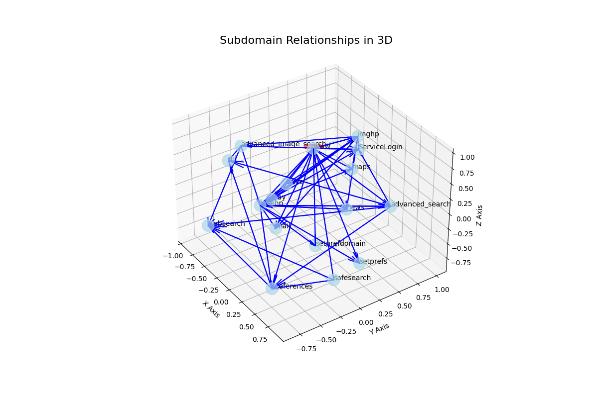

# 3D Subdomain Visualization with Scrapy and NetworkX

This project is a web scraping tool built with Scrapy that extracts and visualizes subdomain relationships from a specified starting URL in a 3D graph format, *that can be rotated and zoomed in* using NetworkX and Matplotlib. It helps to understand the structure of a domain's subdomains by displaying how they link to each other.

# Example: 3D Google Subdomain Representation



## Features

- Scrapes web pages for links within the same domain.
- Extracts subdomains and their relationships.
- Visualizes the subdomain relationships in a 3D directed graph.
- Displays the name of each node when hovered over in the visualization.

## Requirements

- Python 3.x
- Scrapy
- NetworkX
- Matplotlib

## Usage

To run the spider, use the following command in your terminal:

```bash
scrapy runspider your_spider_file.py -a start_url="http://example.com"
```

Replace your_spider_file.py with the filename where your spider code is located and http://example.com with the starting URL you want to scrape.

Clone the repository:

```bash
git clone https://github.com/your_username/your_repository.git
cd your_repository
    ```

Run the spider:

```bash
scrapy runspider domain_spider.py -a start_url="http://example.com"
```

After the scraping is complete, a 3D visualization will be displayed showing the subdomain relationships.

## Code Overview
DomainSpider Class

    name: The name of the spider.
    custom_settings: Custom settings for the spider, including robot.txt compliance.
    __init__: Initializes the spider with the provided starting URL.
    parse: Parses the response and follows links to extract further data.
    extract_links: Extracts links from the current page and records subdomain relationships.
    visualize_subdomains: Creates a 3D visualization of the subdomain relationships.

## 3D Visualization

The visualize_subdomains method uses Matplotlib to create a 3D scatter plot of subdomains. It adds hover functionality to display node names dynamically.

## Contributing

Contributions are welcome! If you have suggestions or improvements, please create a pull request or open an issue.

## License

This project is licensed under the MIT License - see the LICENSE file for deta
